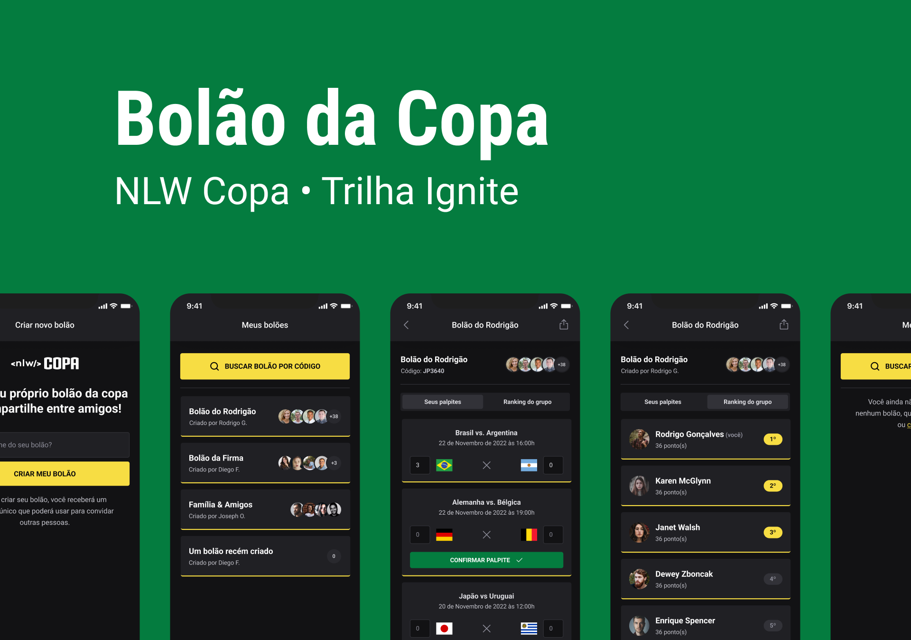

<h1 align="center">
  NLW Copa
</h1>

<p align="center">
  <a href="https://github.com/leondavidtb/nlw-copa" rel="nofollow">Next Level Week</a>
</p>

<p align="center">
  

  

  

  

</p>

<br/>



## 💻 Project

Project developed during the last NLW of 2022 promoted by Rocketseat.
Application for creating pools for the cup, where it is also possible to login with Google and join a pool and register guesses.

## 🚀 Technologies

This project was developed with the main following technologies:

- [React](https://reactjs.org)
- [React Native](https://reactnative.dev)
- [Node.js](https://nodejs.org/en/)

## 🔖 Layout

You can view the layout of the project in the [web & mobile](<https://www.figma.com/file/yRgGRRZOWkjUcDUNt9ABLz/Bol%C3%A3o-da-Copa-(Community)-(Community)?node-id=0%3A1>) versions.

## ℹ️ How To Use

To clone and run this application, you'll need [git](https://git-scm.com), [yarn](https://legacy.yarnpkg.com), [node](https://nodejs.org/en/). From your command line:

```bash
# Clone the repository
$ git clone https://github.com/leondavidtb/nlw-copa.git
```

### 🖥️ Web

```bash
# Go into the repository
$ cd nlw-copa/web
# Install dependencies
$ npm install
# Run the development server
$ npm run dev
# The app will automatically reload if you change any of the source files.
```

### 📱 Mobile

```bash
# Go into the repository
$ cd nlw-copa/mobile
# Install dependencies
$ npm install
# Run the development server
$ npx expo start
# The app will automatically starts Metro Bundler. You may use an emulator or your own smartphone.
# The app will automatically reload if you change any of the source files.
```

### ⚙️ Server

```bash
# Go into the repository
$ cd nlw-copa/server
# Install dependencies
$ npm install
# Create the .env file in the repository using the sample file .env.example
# Run the development server
$ npm run start
# The app will automatically reload if you change any of the source files.
```

---

<p align="center">Made with ☕ by Leonardo David 👋🏻 <a href="https://www.linkedin.com/in/leondavidtb/">Get in touch!</a></p>
